# LiDAR Water Tank Monitor

## Overview

The LiDAR Water Tank Monitor is an ESP32-based (Sunton esp32-2432S032C) project designed to measure and monitor water levels in a tank using a LiDAR sensor. The system integrates with **Home Assistant** via MQTT, providing real-time data on water levels, temperature, and humidity. It features a 3.2-inch capacitive TFT display with LVGL for a user-friendly interface.

The sensor and ESP32 board are connected using an S/FTP Ethernet cable (up to 10 meters), which ensures reliable communication and power delivery over longer distances. This setup helps minimize interference and signal loss, making it suitable for installations where the tank and display/controller are physically separated.

## Table of Contents

- [LiDAR Water Tank Monitor](#lidar-water-tank-monitor)
  - [Overview](#overview)
  - [Table of Contents](#table-of-contents)
  - [Key Features](#key-features)
    - [Main Features](#main-features)
    - [Home Assistant Integration Example](#home-assistant-integration-example)
    - [Hardware](#hardware)
    - [Software](#software)
    - [Customizable Settings](#customizable-settings)
  - [How its Work](#how-its-work)
  - [Development Environment Setup Instructions](#development-environment-setup-instructions)
  - [Pictures](#pictures)
    - [SquareLine Studio Settings](#squareline-studio-settings)
  - [Recommended Wiring Example](#recommended-wiring-example)
  - [Example Circuit](#example-circuit)
  - [T568B Pinout](#t568b-pinout)
  - [Bill of Materials (BOM)](#bill-of-materials-bom)
  - [Sunton esp32-2432S032C Description](#sunton-esp32-2432s032c-description)
  - [Purchase Links](#purchase-links)


## Key Features

### Main Features

- Real-time water level graph visualization
- Temperature and humidity display visualization
- RSSI Visualization
- **WiFi Management:** Scan/connect, display signal strength
- **Backlight Control:** Manual/automatic brightness
- **NTP Time Sync:** Synchronize with NTP servers
- **EEPROM Storage:** MQTT credentials, tank parameters, Wifi
- **MQTT Discovery:** Auto-publish sensor data to Home Assistant
  - Distance (mm)
  - Humidity (%)
  - Liter (L)
  - TankLevelTankLevel (%)
  - Temperature (°C)
- **Misc:**:
  - Dark Mode
  - Languge settings
  - Rotate Screen horizontaly (180°)
  - SW reset Button
  - Runtime Calc
  - FW update Over the AIR

  ### Home Assistant Integration Example

  <p align="center">
    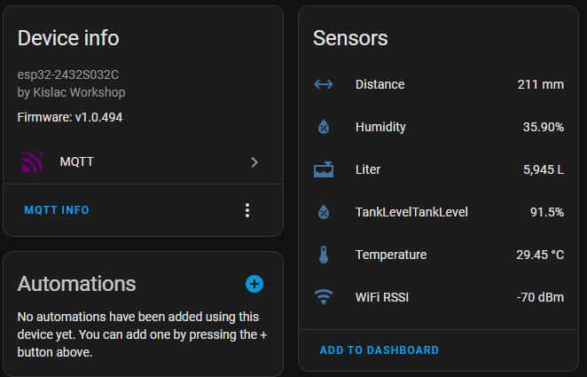
  </p>


### Hardware
- Main HW: Sunton esp32-2432S032C
  - **Microcontroller:** ESP32-D0WDQ6 (Dual-core, 240 MHz, 4 MB SPI Flash)
  - **Display:** 3.2-inch TFT LCD (320x240, 65K colors)
  - **Touchscreen:** GT911 capacitive touch controller (I2C)
  - **Audio:** PWM audio output with built-in amplifier
  - **Connectivity:** WiFi 802.11 b/g/n, Bluetooth v4.2 + BLE
  - **Power Supply:** 5V via USB Type-C, built-in LiPo charging IC
  - **GPIO:** Limited (many pins used for peripherals)
  - **LED:** RGB Led
  - **LightSensor:** used for auto backlight
- **Sensors:**
  - **LiDAR**: TOF400C-VL53L1X
  - **Temperature & Humidity**: AHT10

### Software

- **Framework:** VSCode: Arduino with PlatformIO
- **Libdeps**: 
	- https://github.com/rzeldent/esp32-smartdisplay
	- lvgl/lvgl@^9.2.2
	- knolleary/PubSubClient@^2.8
	- adafruit/Adafruit AHTX0@^2.0.5
	- pololu/VL53L1X@^1.3.1
	- bblanchon/ArduinoJson@^7.4.1
- **UI Library:** LVGL (v9.1.0)
- **Integration:** MQTT for Home Assistant
- **OTA Updates:** Firmware updates via HTTPS
- **PCB Design:** Sprint Layout 6.0
- **CNC File Preparation:** FlatCam
- **PCB Engraving:** UGS 2.1.13 (Universal Gcode Sender)
- **MQTT Testing:** MQTT Explorer 0.4

### Customizable Settings

- Tank type (cylinder or rectangle)
- Tank dimensions and calibration

---

## How its Work

>The system uses a distance sensor mounted above the water tank. The sensor continuously measures the distance from itself to the water surface. Using the tank's dimensions (such as height and diameter), the software calculates the current water level and the total volume of water remaining in the tank. This information is displayed in real time on the screen. Additionally, the system sends water level data via MQTT to Home Assistant for remote monitoring and automation.
---
<p align="center">
    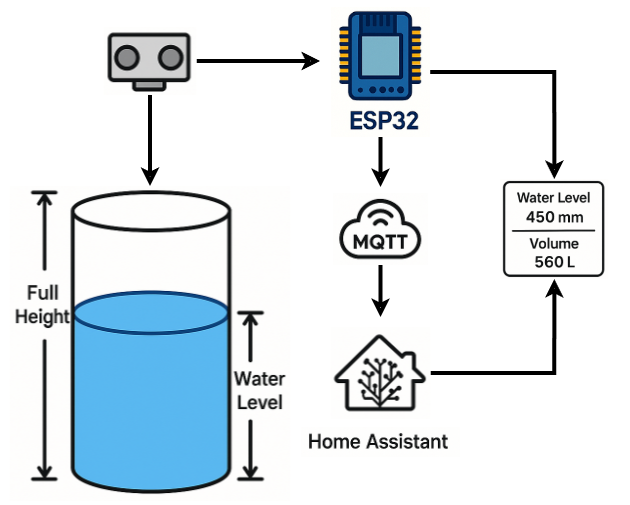
  </p>

## Development Environment Setup Instructions
*Only need if you wold like to modify something

1. **Follow these steps:**  
  [https://github.com/rzeldent/esp32-smartdisplay](https://github.com/rzeldent/esp32-smartdisplay)

2. **Install SquareLine Studio:**  
  Version: `SquareLine_Studio_Windows_v1_4_2`

3. **Clone the PlatformIO board definitions:**  
  - Repository: [https://github.com/rzeldent/platformio-espressif32-sunton](https://github.com/rzeldent/platformio-espressif32-sunton)
  - Copy the board definitions to:  
    `<home>/.platformio/platforms/espressif32/boards`
  - 
4. **Create new projects**
  - use the `esp32-2432S032C` board and Aurdiono 
  - Copy  `\.pio\libdeps\esp32-2432S032C\lvgl\lv_conf_template.h`  
  to `\include` and rename to `lv_conf.h` and enable it with `#if 1`
- Provide LVGL config path in `pf.ini` with:  
  `-D LV_CONF_PATH="D:\GIT\water-tank-monitor\include\lv_conf.h"`
- Add `lvgl/lvgl@^9.2.2` library to the project

5. **Memory Map update**
LVGL are using too much Dram. So need to modify the Dram mapping
Find this file
`C:\Users\ikl2bp\.platformio\packages\framework-arduinoespressif32\tools\sdk\esp32\ld\memory.ld`:
Update this part to this:
>dram0_0_seg (RW) : org = 0x3FFB0000 + 0xdb5c,<br>
             len = 0x32710 - 0xdb5c

*Explanation:*
- Start address: `0x3FFB0000`
- Offset: `0xdb5c` (56,796 decimal)
- Total length: `0x30000` (196,608 decimal)
- Available memory: `0x30000 - 0xdb5c = 0x224A4` (140,812 decimal)

---
## Pictures

<p align="center">
  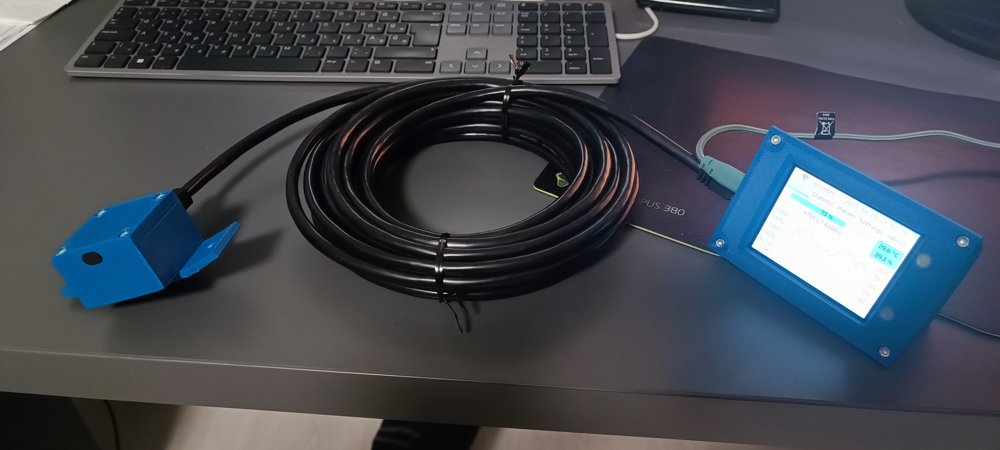
  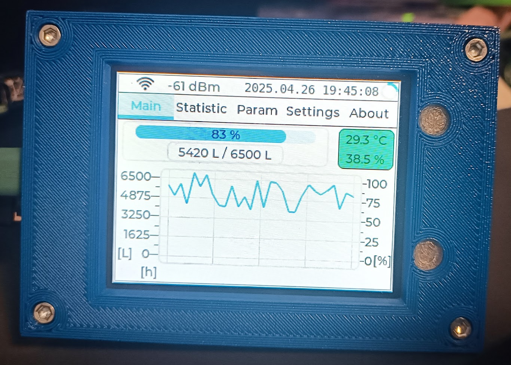
  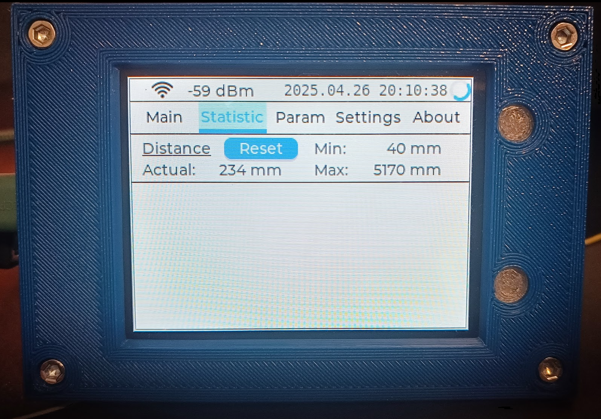
  
  
  
</p>

---


## SquareLine Studio Settings

- **New Project:**
  - Major LVGL version: 9.1
  - Visual Studio for development on Windows PC (v2.0.1)
  - Resolution: 320x240
  - Color Depth: 16 Bit
  - LVGL version: 9.1.0
  - Project Export Root: `D:\GIT\water-tank-monitor`
  - UI Files Export Path: `D:\GIT\water-tank-monitor\src\ui`
  - LVGL Include Path: `lvgl.h`
  - Call functions export file: *do not export*

---

## Recommended Wiring Example

| Pair | Color                | Signal                |
|------|----------------------|-----------------------|
| 1    | Green + Green/White  | SDA + GND             |
| 2    | Orange + Orange/White| SCL + GND             |
| 3    | Blue + Blue/White    | +5V + empty           |
| 4    | Brown + Brown/White  | Optional: LED or GPIO |

- Use a lower I2C speed (e.g., 100kHz)
- Use stronger pull-up resistors (e.g., 1.5kΩ instead of 2.2kΩ)
- According to the I2C specification, pull-up resistors are required on SDA and SCL lines.

| Length | Voltage | Recommended Pull-up |
|--------|---------|---------------------|
| < 1 m  | 3.3V    | 4.7kΩ – 10kΩ        |
| 5–6 m  | 3.3V    | 2.2kΩ – 3.3kΩ       |

---

## Example Circuit

```text
ESP32
  ├── SDA ---[2.2kΩ]---+--- SDA wire ---> VL53L1X & AHT10
  │                   |
  │                  3.3V
  └── SCL ---[2.2kΩ]---+--- SCL wire ---> VL53L1X & AHT10

VL53L1X & AHT10
  └── 3.3V ---||--- GND (100nF + 10µF in parallel)
```

---

## T568B Pinout

1. Orange/White    → GND  
2. Orange          → SCL  
3. Green/White     → GND  
4. Blue            → +5V  
5. Blue/White      → Empty  
6. Green           → SDA  
7. Brown/White     → Empty  
8. Brown           → Empty  

---


## Bill of Materials (BOM)
|Picture|Item|Needed|Price(EUR)|Price (HUF)|AliExpress Link| Hungarian Distributor Link|
|-|-|-|-|-|-|-|
||Sunton<br> esp32-2432S032C|1|20 eur|8500 huf|[AliExpress](https://www.aliexpress.com/item/1005008599170226.html?spm=a2g0o.productlist.main.1.632a1736VRefqW&algo_pvid=c923002b-3d98-4b70-b896-e100be93db21&algo_exp_id=c923002b-3d98-4b70-b896-e100be93db21-0&pdp_ext_f=%7B"order"%3A"2"%2C"eval"%3A"1"%7D&pdp_npi=4%40dis%21HUF%218710.51%218276.09%21%21%2123.66%2122.48%21%402103917f17456769168285149e6771%2112000045892717254%21sea%21HU%21165456939%21X&curPageLogUid=LtDidy4eRF31&utparam-url=scene%3Asearch%7Cquery_from%3A)|[Tavir](https://shop.tavir.hu/termek/kiegeszitok/kommunikacio/esp32-lvgl-development-board-3-2-lvgl-touch-esp32-2432s032c/?srsltid=AfmBOoqIuTgXB7QGG7ofbmLhUPk6bJUt_erjq2x_8ICg9mv25QExsPcZ)|
|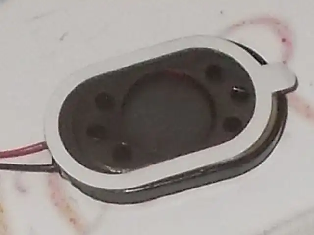|MiniSpeaker <br>(8R 1W)<br> (Optionally)|1|1 eur|400 huf|[AliExpress](https://www.aliexpress.com/item/1005006116555207.html?spm=a2g0o.productlist.main.12.28a54mbg4mbgBk&algo_pvid=211da820-1a80-4dd3-8641-405bd4ab72c2&algo_exp_id=211da820-1a80-4dd3-8641-405bd4ab72c2-11&pdp_ext_f=%7B"order"%3A"178"%2C"eval"%3A"1"%7D&pdp_npi=4%40dis%21HUF%21921.25%21792.09%21%21%2118.26%2115.70%21%4021038e6617456773259747782e78fa%2112000035824265950%21sea%21HU%21165456939%21X&curPageLogUid=WIlYI5tJOtuN&utparam-url=scene%3Asearch%7Cquery_from%3A)|[Tavir](https://shop.tavir.hu/termek/modulok/hangkeltes-mp3-erosito/mini-hangszoro-8r-1w/)|
|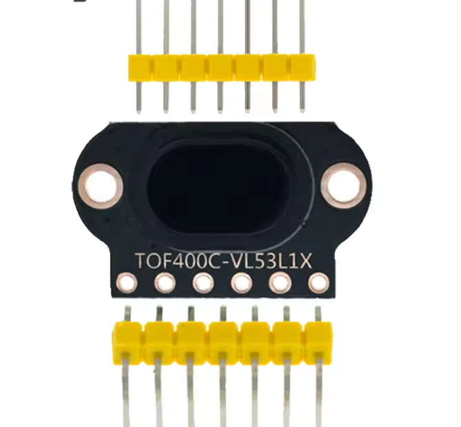|TOF400C-VL53L1|1 pcs|5 eur|2000 huf| [AliExpress](https://www.aliexpress.com/item/1005006160743016.html?spm=a2g0o.order_list.order_list_main.10.6d311802U5VZOT)| [Hestore](https://www.hestore.hu/prod_10041187.html?gad_source=1&gclid=Cj0KCQjwiLLABhCEARIsAJYS6unt5quxkfF2_4SqqQaWyOaD3Lwgzoylcigu6t7i1H6qDEFLWvrN-CMaAqVfEALw_wcB)|
|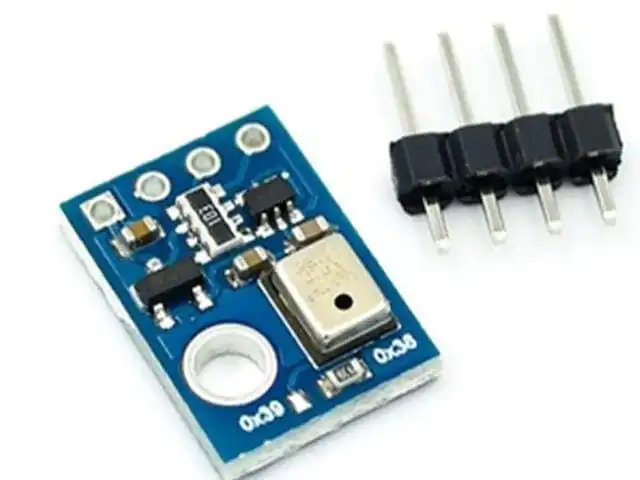|AHT10|1 pcs|2.5 eur|1000 huf|[AliExpress](https://www.aliexpress.com/item/1005005023375532.html?src=google&albch=search&acnt=479-062-3723&isdl=y&aff_short_key=UneMJZVf&albcp=266121556&albag=7593673036&slnk=&trgt=dsa-42862830006&plac=&crea=426823514858&albad=426823514858&netw=g&device=c&mtctp=&memo1=&albbt=Google_7_search&aff_platform=google&albagn=888888&isSmbActive=false&isSmbAutoCall=false&needSmbHouyi=false&gad_source=1&gclid=Cj0KCQjwiLLABhCEARIsAJYS6umhiqMehTujN-VKJJJNx4mUn3w9dylqnrinE9NRaQ_YExPbri5FiFYaAleQEALw_wcB)|[Tavir](https://shop.tavir.hu/termek/modulok/homerseklet/aht10-ho-paraszenzor/)|
|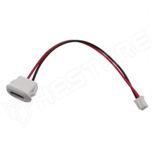|PWR-USB-C-PH2-WH|1pcs|? eur|? huf|-|[Hestore](https://www.hestore.hu/prod_10047569.html)|
|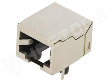|DS1126-S80B <br>(or similiar)|2pcs|1 Eur|400 Huf|-|[Hestore](https://www.hestore.hu/prod_10041015.html)|
|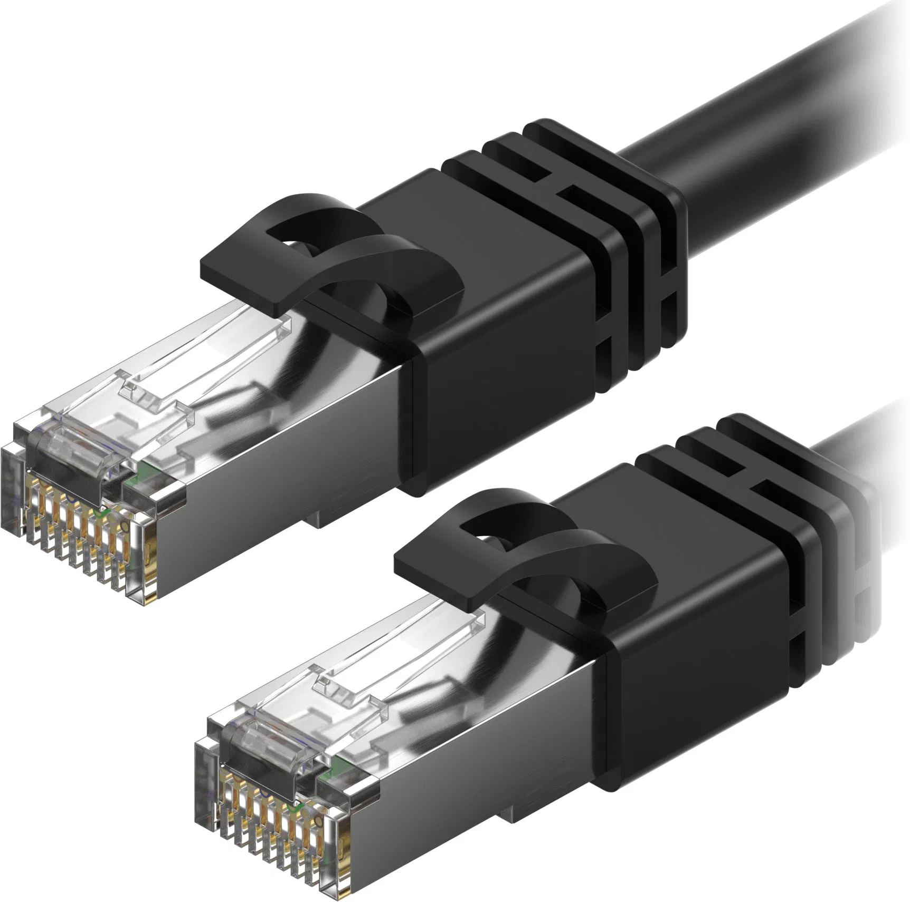|S/FTP|1pcs|14 Eur|5500 Huf|-|[Alza](https://www.alza.hu/alzapower-patch-cat7-s-ftp-30m-sedy?dq=12481409)|
|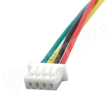|JT-A1250H-4P-300|2pcs|1 eur|500 Huf|-|[Hestore](https://www.hestore.hu/prod_10047751.html)|
|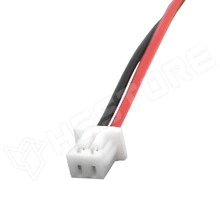|JT-A1250H-4P-300|2pcs|1 eur|500 Huf|-|[Hestore](https://www.hestore.hu/prod_10047749.html)|
|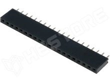|ZL262-20SG|2 pcs|1 eur|400 Huf|-|[Hestore](https://www.hestore.hu/prod_10028051.html)|
|Total|-|-|~47 Eur|~19200 Huf||-|


---

## Sunton esp32-2432S032C Description

## Purchase Links

- **OEM Product Page:**  
  [displaysmodule.com - 3.2" Capacitive TFT Display Module (240x320, ESP32, LVGL, SPI)](https://www.displaysmodule.com/sale-36526879-capacitive-3-2-inch-tft-display-module-240x320-esp32-lvgl-spi-lcd-module.html)

- **Sunton Official AliExpress Store:**  
  [AliExpress Store #1102010846](https://www.aliexpress.com/store/1102010846)

- **Example AliExpress Listing:**  
  [ESP32-2432S032C Board - AliExpress](https://www.aliexpress.com/item/1005007053922331.html)

- **Hungarian Distributor:**  
  [Tavir.hu - ESP32 LVGL Development Board 3.2"](https://shop.tavir.hu/termek/kiegeszitok/kommunikacio/esp32-lvgl-development-board-3-2-lvgl-touch-esp32-2432s032c/?srsltid=AfmBOooOszb6GM9uCqxlBiMFgtcHPgtMvOhoaquYM0NxKTm8StLZUtcw)

**Main Features:**

- **Microcontroller:**  
  ESP32-D0WDQ6 (Dual-core, 240 MHz)

- **RAM:**  
  520 KB internal SRAM  
  *No separate PSRAM on this board*

- **ROM:**  
  448 KB

- **Flash Memory:**  
  4 MB SPI Flash (for programming and data storage)

- **Display:**  
  3.2 inch, 320x240 pixel, 65K color, TFT-LCD  
  ST7789 controller (SPI interface)  
  GT911 capacitive touch controller (I2C interface)

- **Touchscreen Connection:**  
  I2C bus (default: IO32 - SDA, IO33 - SCL)

- **Audio:**  
  PWM audio output: GPIO26 (amplified, via PicoBlade connector)  
  Built-in amplifier

- **Other Peripherals:**  
  RGB LED  
  Light sensor (generally not functional)  
  SD card slot (SPI)

- **Communication:**  
  WiFi 802.11 b/g/n  
  Bluetooth v4.2 + BLE

- **Power Supply:**  
  5V via USB (Type-C)  
  Built-in LiPo battery charging IC (*does not support deep sleep!*)

- **GPIO Connectors:**  
  Limited availability, as many pins are fixed for display, touch panel, audio output, etc.

